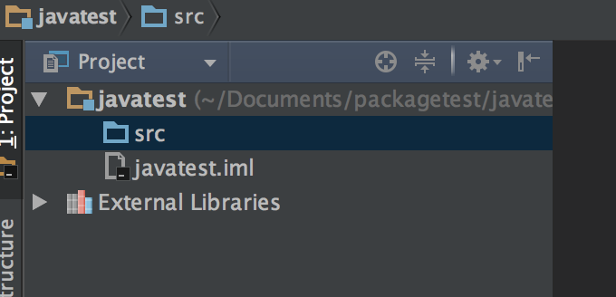

# 一级标题 github 上md语法
------------
## 二级标题
**这是加粗的字体**  
_这是倾斜的字体_  
**这是加粗的字体;_加粗加斜体_**  
引用：我需要在文中插入快捷键`ctrl+v`  
代码引用：
``` java
int a = 1;
int b = 2;
int c = a+b;
int d=0;
```
在markdown语言中,唯一决定两行文字是否是段落的,就在于这两行文字之间是否有空行. 注意段落和空行的关系。  
- 主列表1  
- 主列表2  
  1. 次列表1   
  1)次次列表1  
  2)次次列表2  
  3)次次列表3
  2. 次列表2  
- 主列表3  

新的段落  

&emsp;&emsp;\*\*取消Markdown关键字

这是分割线

这是链接：[简书链接](http://www.jianshu.com)  
这是图片链接：  
  
段落1  
&emsp;&emsp;首行缩进两字符

段落2  
&emsp;&emsp;段落2首行缩进  


段落3  

表格  
|学号|姓名|分数|
|-|-|-|
|小明|男|75|
|小红|女|79|
|小陆|男|92|